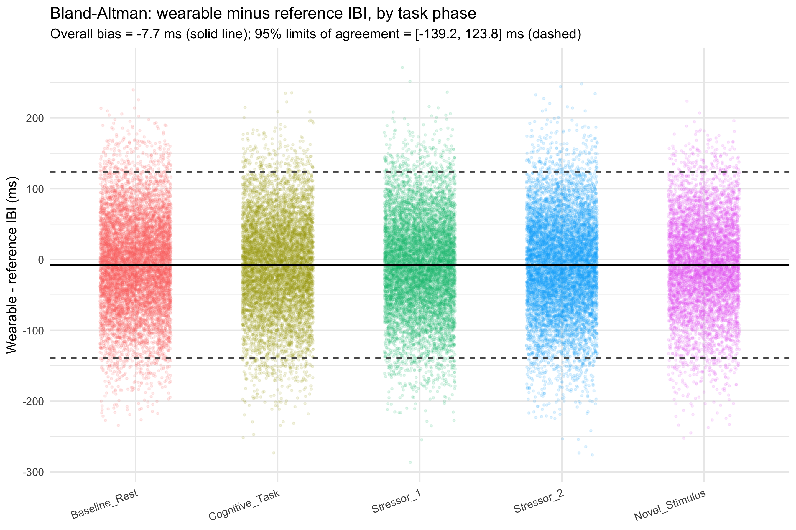
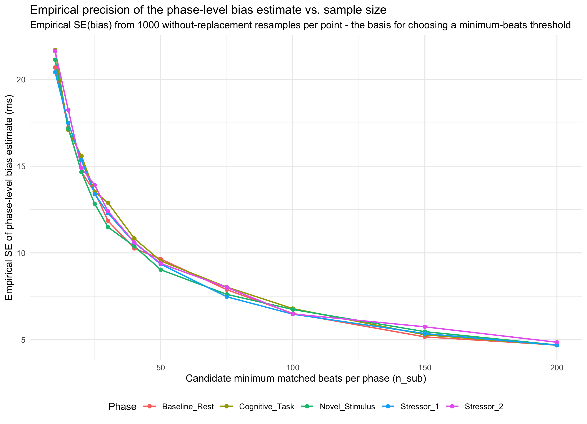

# Wearable Pulse-Rate Validation Pipeline (Portfolio Demo)

A self-contained, reproducible R pipeline that validates a wrist-worn optical
(PPG) pulse sensor's beat-to-beat (pulse-to-pulse interval / PPI) accuracy
against a reference sensor — distilled from a real applied-research project
on wearable validation.

**Terminology note:** this repo uses "pulse rate" and "PPI" (pulse-to-pulse
interval) throughout, not "heart rate" or "IBI" (inter-beat interval). Both
devices modelled here are optical (photoplethysmography) sensors, which
detect the pulse wave at the wrist, not the heart's electrical activity
directly.

**All data in this repository is synthetic.** No real subjects, dates, or
measurements are included anywhere. The synthetic data is generated by
`R/01_generate_synthetic_data.R` and is deliberately constructed to reproduce
two real data-processing and validation problems from the original project, so they can be
diagnosed and solved here the same way they were solved there.

## Why this exists

Most of what this pipeline does — matching two sensors' beats in time,
computing agreement statistics, deciding on quality thresholds — sounds
simple until the data gets real: timestamps that look comparable but
aren't, and QC thresholds that need a defensible answer, not a round number.
This repo is built around two decisions from the original project that show
how I approach exactly that kind of problem:

1. **A timezone bug that looked like a matching-logic bug.** Beats from the
   wearable stopped matching their scheduled task windows almost entirely. It
   turned out the raw device timestamps were timezone-naive strings that a
   downstream parser silently defaulted to UTC, while the task schedule was
   parsed with the correct local timezone — so both sides looked aligned
   but disagreed about the actual instant by exactly the UTC offset of the
   local timezone on that date (+1h in winter, +2h in summer). The fix came
   from following the evidence (the offset tracked the calendar, not
   randomness) rather than guessing at the matching code.
   → `R/02_diagnose_and_fix_timezone_bug.R`

2. **Calibrating a QC threshold empirically instead of guessing.** How many
   matched beats does a phase-level accuracy estimate need before it's
   trustworthy? Instead of an arbitrary round number or a closed-form formula
   that assumes a normal distribution, this resamples (without replacement)
   from the dataset's own observed, possibly-skewed error values at each
   candidate sample size and measures how much the resulting estimate
   actually varies. The threshold decision is then a defensible trade-off
   between empirical precision and how much data it would exclude.
   → `R/04_calibrate_min_beats_resampling.R`

See `docs/case_study.md` for the full write-up of the timezone bug as a
diagnostic story.

## Example outputs

**Bland–Altman agreement analysis**



**Empirical calibration of the minimum-beat QC threshold**



## Pipeline

```
R/00_config.R                            shared parameters (paths, phases, thresholds)
R/01_generate_synthetic_data.R           synthetic wearable + reference beat data, 24 subjects
R/02_diagnose_and_fix_timezone_bug.R     reproduces + fixes the timezone bug, writes matched beats
R/03_compute_ppi_accuracy.R              Bland-Altman bias/LoA + MAE, by task phase
R/04_calibrate_min_beats_resampling.R    empirical resampling calibration of the QC threshold
R/05_make_plots.R                        Bland-Altman plot + calibration curve
run_all.R                                runs all five steps in order
```

## Setup

Clone or download the repository and open wearable-validation-pipeline-demo.Rproj in RStudio. Then restore the package environment and run the pipeline:

install.packages("renv")  # if needed
renv::restore()
source("run_all.R")

Alternatively, from the project directory:
Rscript run_all.R

Outputs are written to output/tables/ and output/plots/; synthetic intermediate data is generated in data/raw/ and data/processed/.

## Methodology notes

- **Event-phase, not fixed time windows, as the analysis unit.** Accuracy is
  summarised per task phase (e.g. a stressor task), because that is what the underlying research question
  actually needs answered.
- **Bland-Altman bias + limits of agreement as the primary accuracy metric**,
  with MAE and percent-within-tolerance reported alongside as more
  interpretable secondary measures.
- **Nearest-neighbour beat matching with a maximum time-gap cutoff**,
  preventing beats missed during wearable dropout from being matched to
  implausibly distant reference beats.
- **Empirical, not closed-form, uncertainty quantification** for the QC
  threshold decision — see point 2 above.

## Requirements

R 4.5.2 with the packages: `here`, `dplyr`, `purrr`,
`readr`, `tidyr`, `lubridate`, `ggplot2`.

Package versions are pinned with [renv](https://rstudio.github.io/renv/) for
exact reproducibility. 

## Scope

This portfolio demo focuses on these two cases rather than reproducing the full research pipeline, which additionally included cross-correlation-based synchronization diagnostics, movement-related analyses of measurement accuracy, and sensitivity analyses comparing alternative preprocessing decisions.
